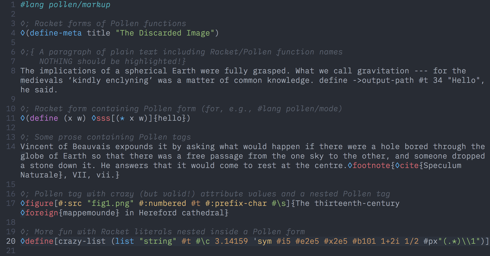
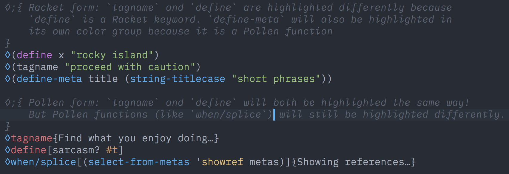

# vim-pollen

Syntax highlighting for [Pollen](http://docs.racket-lang.org/pollen/), a Racket language by Matthew Butterick for making books.

Supports:

 * Highlighting `#lang pollen` and `#lang pollen/mode <reader>`
 * Spell checking (when enabled separately): will only spell check the non-code regions
 * Full highlighting of Racket and Pollen functions/keywords
 * Nested Racket `◊(tag …)` and Pollen `◊tag{…}` forms
 * Variables: `◊foo` or `◊|foo|`
 * String literals: `◊"text"` (can be used for `◊"◊"`)
 * Single-line `◊; …` and multiline `◊;{ … }` comments

Overall I have kept this plugin very simple, with no fancy tricks and no treatment for special edge-cases. It supplies syntax highlighting only: no indentation or special macros.

## Installation

As Pollen is a Racket language, this plugin depends quite a bit on [`vim-racket`](https://github.com/wlangstroth/vim-racket) for correct syntax highlighting. Install that first. 

The most basic way to install _this_ plugin is to save the `syntax/pollen.vim` file into your `~/.vim/syntax` folder.

If you use [pathogen.vim](https://github.com/tpope/vim-pathogen), do it this way:

    cd ~/.vim/bundle
    git clone https://github.com/otherjoel/vim-pollen.git

Or, if you prefer submodules:

    cd ~/.vim
    git submodule add https://github.com/otherjoel/vim-pollen.git bundle/vim-pollen

## Use

To turn on Pollen syntax highlighting manually, do `:set filetype=pollen`.

To turn it on automatically for Pollen’s default file extensions, add these lines to your `.vimrc`:
    
    " Create an augroup if you don’t already have one
    augroup configgroup
        autocmd!
        
        "Set Pollen syntax for files with these extensions:
        au! BufRead,BufNewFile *.pm set filetype=pollen
        au! BufRead,BufNewFile *.pp set filetype=pollen
        au! BufRead,BufNewFile *.ptree set filetype=pollen
        
        " Suggested editor settings:
        autocmd FileType pollen setlocal wrap      " Soft wrap (don't affect buffer)
        autocmd FileType pollen setlocal linebreak " Wrap on word-breaks only
    augroup END
    
For now, this plugin doesn’t come with any automatic file-typing; you need to know how to turn Pollen syntax on in a way that fits with your workflow. This is for a few reasons:

* Pollen doesn’t have its own set of file extensions, strictly speaking.
* Any Racket module can use `#lang pollen` or one of its variants.
* Some of Pollen’s default file extensions (`.p` and `.pm`) are also used by Python and Perl.

If you use Pollen Markdown files (`.pmd`) it might be more appropriate to use Markdown highlighting for those.

### Potential conflicts with other plugins

_(NB: What follows is hard-won knowledge about the solution to a potentially very strange problem)_

If you use the `vim-pencil` plugin and have it “turned on” for Pollen files, it will break parts of Pollen syntax highlighting because it changes the `iskeyword` setting (the set of characters that Vim considers to be part of a keyword).

The same holds true for any other plugin that changes the `iskeyword` value. If you suspect this is happening, you can run `:verbose setlocal iskeyword?` and it will tell you the current value as well as the path/filename of the script that last changed it.

[What I do](https://github.com/otherjoel/vim/blob/master/vimrc), for now, is to leave `pencil#init()` out of my auto-commands for Pollen files, and just enable it manually with `:Pencil` after the file is open. Another remedy is to make sure that, _after_ the call to `pencil#init()`, `iskeyword` gets reset to the value used for Racket code (i.e., [this value](https://github.com/wlangstroth/vim-racket/blob/f76fde9afbc008b7468c9ea026cbe3840af5f5ef/syntax/racket.vim#L22) as of the time I write this).

### Syntax edge cases

This plugin **is** opinionated about using the default command character `◊`. If you [change the command character in your project](http://docs.racket-lang.org/pollen/Setup.html#%28part._setup-overrides%29), you’ll need to replace it everywhere in this plugin’s `syntax/pollen.vim` file as well.

There’s also currently no support for `◊tag|{...}|` or `◊tag|<<<{...}>>>|`. These forms aren’t even covered in Pollen’s documentation, but Pollen can use them by virtue of its Scribble heritage.

Finally: in any form `◊func[…]{…}`, the symbol `func` will always be highlighted in the same way, even when it is a Racket keyword/function (e.g. `define`, `string=?`, `let`, etc). Pollen-provided functions _are_ highlighted differently in this form, however. Here’s an example to illustrate:

## Misc

The font used in the screenshots is [IBM Plex Mono Light](https://ibm.github.io/type/). The color scheme is [One Dark](https://github.com/joshdick/onedark.vim).
